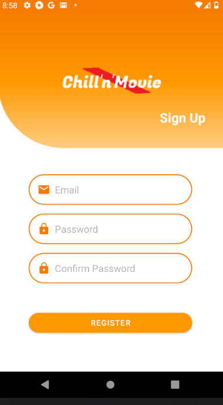
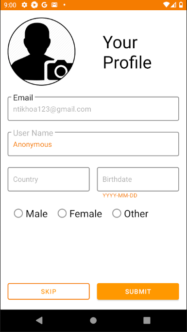
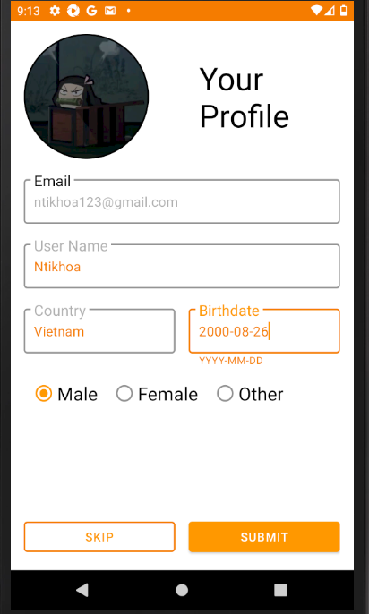
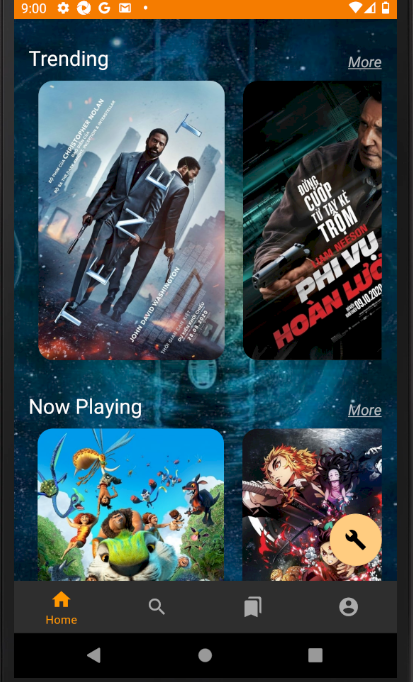

# ChillnMovie
This project is not done yet
demo link: youtube.com/?????
# Introduction
ChillnMovie is an movies rating source where users can get the information related to movies and rates their favorite movies. It also updates and recommends movies 
to user in categories like: trending, top rated, upcoming, now playing, Vietnamese movies.
# How it works
ChillnMovie has to type of end users: editors and users. Editors is control the data that the users can see. Editor can edit movies, add a new movies and add a summary
reviews for the film, Editor can also add a movies in different categories.
# Architecture
# Preview
## 1. Login and Signup

## 2. Home Page

