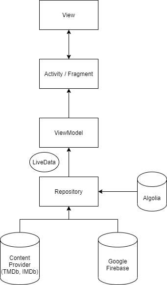

# ChillnMovie
demo link: https://www.youtube.com/watch?v=JE2nJsIrVoA&ab_channel=KhoaNguyen
# Introduction
ChillnMovie is an movies rating source where users can get the information related to movies and rates their favorite movies. It also updates and recommends movies 
to user in categories like: trending, top rated, upcoming, now playing and Vietnamese movies.
# How it works
ChillnMovie has two type of end users: editors and users. Editors is control the data that the users can see. Editor can edit movies, add a new movies and add a summary
reviews for the film, Editor can also put movies in different categories.
# Architecture (MVVM model)

# Technique uses
* Java
* MVVM model (architecture component, live data)
* Hilt
* RESTful API (Retrofit)
* Google Firebase (Firestore, Auth, Storage)
* Algolia (full text search)
* Pagination (Paging 3)
* Material Design
* Animation
* View Binding
# Weeknesses
* Concurrency error
* Background jobs are not handle properly
* Does not apply best practice
* Java T_T
# Portfolio
## Authentication

## Home

## Movie Detail

## Edit Movie

